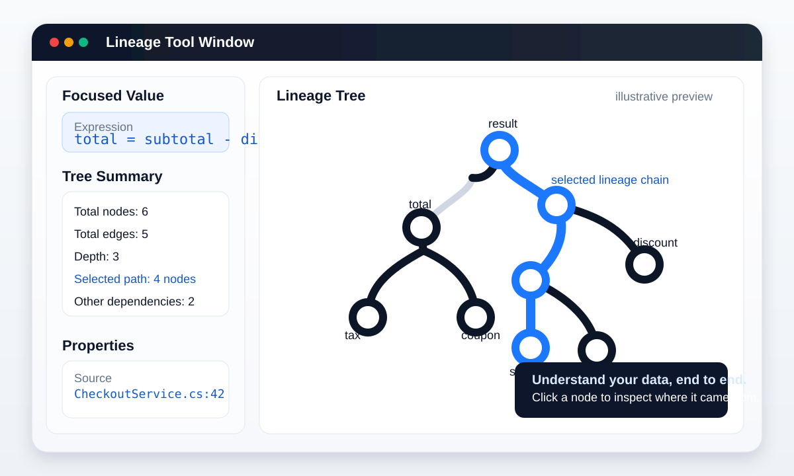

<p align="center">
  
</p>

<h1 align="center">Lineage</h1>

<p align="center">
  <strong>Value-provenance debugging for .NET.</strong><br />
  Select a value. See where it came from.
</p>

<p align="center">
  <strong>v0.1.0</strong> · Experimental early release
</p>

---

**Lineage** is an experimental .NET value-provenance debugger. Its purpose is to answer one question extremely well:

> **Why does this value have this value?**

Traditional debuggers are excellent at showing the current state of a program. They show variables, call stacks, breakpoints, objects, memory, and execution flow. What they do not naturally show is the complete history behind a particular runtime value.

Lineage is intended to fill that gap.

## Vision

When a developer encounters a value that is wrong, surprising, or simply difficult to understand, Lineage should make it possible to select that value and immediately inspect how it came into existence.

Instead of forcing the developer to manually work backward through methods, conditions, calculations, configuration, mappings, and intermediate values, Lineage records the relationships that produced the value and presents them as an explorable lineage tree.

The result should feel less like inspecting program state and more like inspecting **cause and effect**.

### The product promise

Lineage should reveal the inputs that contributed to a value, the transformations that changed it, the decisions that affected it, and the source locations responsible for each meaningful step.

The developer should be able to follow one focused path from the final value back to its meaningful origin, while still being able to inspect alternate dependencies when needed.

The visible tree is only one part of the product. Underneath it, Lineage is building a runtime model of **data provenance**: a record of how values relate to one another during execution.

Over time, that provenance model should understand more of the behavior that matters in real .NET applications, including calculations, assignments, parameters, return values, object properties, collection transformations, configuration values, branching decisions, asynchronous operations, and other common value-producing behavior.

The UI then turns that provenance into something a developer can reason about.

### The ideal debugging experience

Using Lineage should eventually feel natural inside the debugger.

A developer encounters an unexpected value, asks Lineage to show its history, and gets a focused tree rather than a giant execution trace.

The important causal path is visually emphasized. Unrelated dependencies remain available, but they do not dominate the view. Each node should communicate what happened, what value existed at that point, and where it came from in the source.

From there, the developer should be able to navigate directly to the relevant code and continue investigating.

The goal is to reduce debugging from:

> “Where should I start looking?”

into:

> “This is the chain that produced the value.”

### The problems Lineage should solve

Lineage is especially useful when values are produced through several layers of application logic.

That includes financial calculations, pricing rules, permissions, configuration-driven behavior, mapping layers, business rules, validation, data transformations, collection pipelines, nested service calls, and other situations where the final value is far removed from its original inputs.

It should become useful for questions such as:

- Why is this number wrong?
- Why is this property null?
- Where did this value change?
- Why did this decision produce this result?
- Which input actually caused this outcome?
- Why is this execution different from another one?

These are all variations of the same underlying problem: understanding provenance.

### What Lineage is not

Lineage is not intended to become a general profiler, logging framework, distributed tracing platform, application-monitoring system, or replacement for the Visual Studio debugger.

Those tools answer different questions.

Lineage should complement them by specializing in **value history**.

It is not primarily about what methods ran. It is not primarily about how long something took. It is not primarily about system health.

It is about **how a particular value was produced**.

That distinction is important because it gives the project a clear identity and a useful boundary for future features.

### Long-term direction

The strongest version of Lineage goes beyond displaying a graph.

The lineage tree should remain the evidence, but Lineage should eventually be able to summarize the important causal chain in human-readable form. Explanations should always be grounded in captured runtime provenance rather than inferred from source code alone.

Another important direction is comparison: being able to compare the provenance of two values or two executions and identify the first meaningful point where they diverged. That could make Lineage especially useful for regressions, failed tests, environment differences, and difficult “works on my machine” problems.

The long-term combination is:

**runtime evidence + source navigation + visual causality + understandable explanation**

### Product principles

Lineage should be built around a small set of principles:

- **Focused, not noisy.** Show the lineage of the value the developer cares about, not every event that occurred.
- **Evidence-based.** Explanations should come from captured runtime provenance rather than guesses based only on source code.
- **Source-connected.** Every meaningful lineage step should lead back to the relevant source location when possible.
- **Low-friction.** Developers should not need to heavily modify their application just to inspect a value.
- **Progressively detailed.** Start with the important causal path, while allowing deeper exploration when needed.

The guiding question for the project is simple:

> **Does this feature help a developer understand why a value exists?**

If it does, it probably belongs in Lineage. If it does not, it probably belongs somewhere else.

## Preview

> Illustrative preview of the Lineage tool-window concept. The UI is still evolving.

<p align="center">
  
</p>

The blue path represents the selected lineage chain: the path that explains how the focused value reached its result. Other dependencies remain visible in black so you can inspect alternate inputs without losing context.

## What it does today

The current `v0.1.0` foundation combines three pieces:

- **Build-time instrumentation** — `Lineage.Instrumentation` rewrites compiled assemblies and injects lineage recording hooks.
- **Lightweight runtime capture** — `Lineage.Runtime` records value relationships and produces a `LineageReport` with origins, nodes, edges, source locations, and value previews.
- **Visual Studio integration** — the VSIX provides a Lineage tool window for exploring captured value history and navigating back to source.

The repository also contains a standalone WPF viewer, sample projects, and automated tests.

## Repository layout

```text
src/
  Lineage.Runtime/          Runtime capture and public API
  Lineage.Instrumentation/  Assembly instrumentation tool
  Lineage.Ide/              Shared graph/session UI logic
  Lineage.VisualStudio/     Visual Studio extension (VSIX)
  Lineage.Viewer/           Standalone WPF viewer
  Lineage.Package/          NuGet package project + MSBuild targets
samples/                    Example projects
tests/                      Runtime, instrumentation, IDE, and integration tests
Lineage.Bundle.proj         Builds the NuGet + VSIX bundle
```

## Requirements

The current source targets:

- `netstandard2.0` for the runtime and package facade
- `net10.0` for the instrumentation tool and console/integration samples
- `net8.0-windows` for the standalone viewer
- Visual Studio extension targets compatible with the manifest's Visual Studio `17.x`–`18.x` range

A matching .NET SDK and Visual Studio workload are required for the projects you build.

## Build

Build the solution normally:

```bash
dotnet build Lineage.slnx
```

To produce the bundled NuGet package and VSIX:

```bash
dotnet msbuild Lineage.Bundle.proj -t:Bundle -p:Configuration=Release
```

The bundle target writes its outputs under `artifacts/`.

## Use the package

For a locally built package, add the generated package source and install `Lineage` version `0.1.0`:

```bash
dotnet add package Lineage --version 0.1.0 --source <path-to-artifacts>
```

The package imports `Lineage.targets`, which enables instrumentation after compilation. Instrumentation can be disabled for a project with:

```xml
<PropertyGroup>
  <LineageInstrument>false</LineageInstrument>
</PropertyGroup>
```

## Trace a value

The runtime exposes both an explicit focus API and a fluent trace helper:

```csharp
using Lineage;

var total = subtotal - discount;

// Produce a report focused on this value.
Lineage.Lineage.Focus(total);

// Or trace inline while preserving the value.
var tracedTotal = total.Trace();

var report = Lineage.Lineage.LastReport;
Console.WriteLine(report);
```

Runtime behavior can be configured through `LineageSettings`, including capture mode, IDE publishing, console output, and break-on-report behavior.

## Visual Studio workflow

Build/install the VSIX from the bundle, open a project using Lineage, rebuild so instrumentation runs, and debug normally. The extension's Lineage tool window consumes published reports and lets you inspect the graph behind the focused value and navigate to recorded source locations.

## Release version

This repository is currently prepared as **v0.1.0**. The shared package version is defined in `Directory.Build.props`; the bundle project and VSIX metadata are kept in sync with it for this release.

## Contributing

Issues and pull requests are welcome. If you are changing instrumentation behavior, add or update coverage in `tests/Lineage.Instrumentation.Tests` and `tests/Lineage.Integration.Tests`; runtime/report changes should be covered in `tests/Lineage.Runtime.Tests`.
