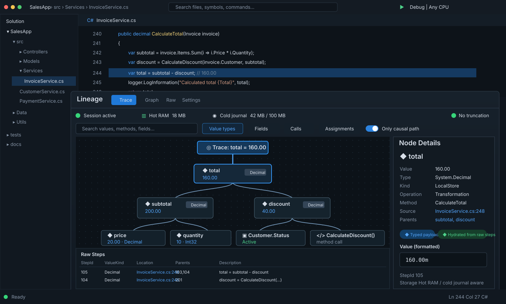

<p align="center">
  
</p>

<h1 align="center">Lineage</h1>

<p align="center">
  <strong>Value-provenance debugging for .NET.</strong><br />
  Select a value. See where it came from.
</p>

<p align="center">
  <strong>v0.2.0</strong> · Provenance Core
</p>

---

**Lineage** is an experimental .NET value-provenance debugger built around one question:

> **Why does this value have this value?**

Traditional debuggers are excellent at showing current program state. Lineage is intended to show the causal history behind a runtime value: the inputs, assignments, calculations, calls, field mutations, decisions, and source locations that contributed to it.

The result should feel less like inspecting program state and more like inspecting **cause and effect**.

## Vision

When a developer encounters a value that is wrong, surprising, or difficult to understand, Lineage should make it possible to inspect how that value came into existence without manually walking backward through every method and intermediate variable.

The lineage tree is the evidence. It should show the important causal path first, keep alternate dependencies available, preserve links back to source, and make the final value understandable in terms of the values that produced it.

The ideal workflow is:

> **Breakpoint → choose a suspicious value → Show Lineage → inspect the causal path**

Explicit `Focus(...)` and `.Trace()` calls remain useful for tests and manual workflows, but they are not the long-term product boundary.

### The product promise

Lineage should reveal:

- which inputs contributed to a value;
- which transformations changed it;
- where assignments and field mutations occurred;
- which calls and decisions affected the result;
- the source location of each meaningful step;
- whether older provenance was unavailable because a configured storage budget was reached.

The guiding question for the project remains:

> **Does this feature help a developer understand why a value exists?**

If it does, it probably belongs in Lineage. If it does not, it probably belongs somewhere else.

### What Lineage is not

Lineage is not intended to become a general profiler, logging framework, distributed tracing platform, application-monitoring system, or replacement for the Visual Studio debugger.

Those tools answer different questions. Lineage specializes in **value history**.

It is not primarily about which methods ran, how long the application took, or whether the system is healthy. It is about **how a particular value was produced**.

## Preview

> Product-direction preview for the Lineage tool window, now grounded in the v0.2.0 runtime model. The exact UI can still evolve, but typed values, causal Steps, source locations, hot RAM, cold-journal storage, and explicit truncation state are all concepts the current core now understands.

<p align="center">
  
</p>

The focused value sits at the top of the causal graph. Parent nodes explain the values that contributed to it, while the details pane can expose the typed value, event kind, operation, source location, and raw provenance identity. The raw-Step view is deliberately separate from the human-readable graph: runtime capture stays compact, while interpretation belongs in the viewer.

## v0.2.0 — Provenance Core

`v0.2.0` moves Lineage from a basic tracing prototype toward a bounded runtime provenance recorder.

The central model is intentionally simple:

```text
Step
  Id
  LocationId
  EventKind
  ValueKind
  compact typed payload

Relation
  ChildStepId
  ParentStepId
```

Runtime Lineage records compact execution facts. Viewer Lineage hydrates those facts into a human-readable causal graph only when a report is requested.

> **Capture the facts in a dense form while the program runs. Expand those facts into meaning only when someone asks a question.**

### Runtime lifetime model

Provenance now follows value lifetime rather than accumulating forever.

- locals and arguments become runtime roots automatically;
- field writes move stable field roots instead of endlessly adding new ones;
- object-field tracking is weak and does not keep application objects alive;
- dead object roots are retired at safe collection points;
- unreachable Steps and Relations are reclaimed while stable Step IDs are preserved.

The governing rule is:

> **A Step can be dropped when nothing still alive can need that Step to explain its history.**

### Bounded hot RAM + cold journal

Lineage records into RAM first. Disk is an overflow tier, not the hot path.

```text
new Steps
   ↓
hot RAM
   ↓
reclaim dead provenance first
   ↓
still-live old ancestry under pressure
   ↓
bounded background spill queue
   ↓
cold journal on disk
```

The cold journal defaults to a **100 MiB hard disk budget**. It is created lazily only when the hot store is under pressure. Pages are handed to a background writer so the application thread does not perform file I/O.

If storage cannot keep up or the disk budget is exhausted, Lineage prefers dropping old provenance over stalling the debugged application. Reports are explicitly marked incomplete rather than pretending the remaining graph is the complete origin.

### Typed value capture

Ordinary value types no longer need to be stored as eager preview strings. The raw Step carries a semantic `ValueKind` and compact payload; formatting is deferred until report/viewer hydration.

The current typed-value foundation covers or recognizes:

- `bool`, `char`;
- signed and unsigned integer widths;
- native integer types;
- `float`, `double`, `decimal`;
- enums;
- `DateTime`, `DateTimeOffset`, `TimeSpan`, `Guid`;
- modern runtime value types including `Half`, `Int128`, `UInt128`, `DateOnly`, and `TimeOnly` while keeping `Lineage.Runtime` compatible with `netstandard2.0`;
- user-defined structs and `ValueTuple` as explicit value categories for the next structural-display pass.

Custom struct/tuple field decomposition and preservation of the original nullable declaration are still follow-up work. Reference-type semantics are deliberately a later phase.

## What it does today

The current `v0.2.0` foundation combines five pieces:

- **Build-time instrumentation** — `Lineage.Instrumentation` rewrites compiled assemblies and injects provenance hooks for constants, locals, arguments, calls, returns, arithmetic, comparisons, branches, and field reads/writes.
- **Compact runtime capture** — `Lineage.Runtime` records normalized Steps and child→parent Relations with stable occurrence IDs.
- **Automatic provenance lifetime tracking** — locals, arguments, fields, weak object lifetimes, and safe-boundary collection keep reclaimable history bounded.
- **RAM-first cold storage** — still-needed old ancestry can spill asynchronously to a rolling journal rather than forcing RAM to grow indefinitely.
- **Visual Studio/report integration** — reports expose semantic nodes, typed value information, source locations, raw provenance, and explicit incomplete-history state for the viewer/tool window.

The repository also contains a standalone WPF viewer, sample projects, runtime/instrumentation/IDE/integration tests, long-session feasibility tooling, and cold-storage stress tooling.

## Repository layout

```text
src/
  Lineage.Runtime/          Runtime recorder, typed values, GC, cold journal, reports
  Lineage.Instrumentation/  Assembly instrumentation tool
  Lineage.Ide/              Shared graph/session UI logic
  Lineage.VisualStudio/     Visual Studio extension (VSIX)
  Lineage.Viewer/           Standalone WPF viewer
  Lineage.Package/          NuGet package project + MSBuild targets
samples/                    Example projects
tests/                      Runtime, instrumentation, IDE, and integration tests
tools/                      Feasibility and cold-storage stress harnesses
docs/                       Architecture and benchmark notes
Lineage.Bundle.proj         Builds the NuGet + VSIX bundle
```

## Requirements

The current source targets:

- `netstandard2.0` for the runtime and package facade;
- `net10.0` for instrumentation and current stress/integration tooling;
- `net8.0-windows` for the standalone viewer;
- Visual Studio extension targets compatible with the manifest's Visual Studio `17.x`–`18.x` range.

A matching .NET SDK and Visual Studio workload are required for the projects you build.

## Build

Build the solution normally:

```bash
dotnet build Lineage.slnx
```

To produce the bundled NuGet package and VSIX:

```bash
dotnet msbuild Lineage.Bundle.proj -t:Bundle -p:Configuration=Release
```

The bundle target writes its outputs under `artifacts/`.

## Use the package

For a locally built package, add the generated package source and install `Lineage` version `0.2.0`:

```bash
dotnet add package Lineage --version 0.2.0 --source <path-to-artifacts>
```

The package imports `Lineage.targets`, which enables instrumentation after compilation. Instrumentation can be disabled for a project with:

```xml
<PropertyGroup>
  <LineageInstrument>false</LineageInstrument>
</PropertyGroup>
```

## Trace a value

The runtime currently exposes an explicit focus API and a fluent trace helper:

```csharp
using Lineage;

var total = subtotal - discount;

Lineage.Lineage.Focus(total);

// Or trace inline while preserving the value.
var tracedTotal = total.Trace();

var report = Lineage.Lineage.LastReport;
Console.WriteLine(report);
```

Runtime behavior can be configured through `LineageSettings`, including capture mode, IDE publishing, console output, break-on-report behavior, and cold-storage policy.

## Visual Studio workflow

Build/install the VSIX from the bundle, open a project using Lineage, rebuild so instrumentation runs, and debug normally. The current extension consumes published reports and lets you inspect captured provenance and navigate to recorded source locations.

The richer tool-window composition shown above is the direction for presenting the provenance model now available in `v0.2.0`.

## Release version

This repository is prepared as **v0.2.0 — Provenance Core**. The shared package version is defined in `Directory.Build.props`; the bundle fallback, package documentation, and VSIX manifest are kept in sync with it.

## Contributing

Issues and pull requests are welcome. Instrumentation changes should add or update coverage in `tests/Lineage.Instrumentation.Tests` and `tests/Lineage.Integration.Tests`; runtime/provenance/report changes should be covered in `tests/Lineage.Runtime.Tests`.
